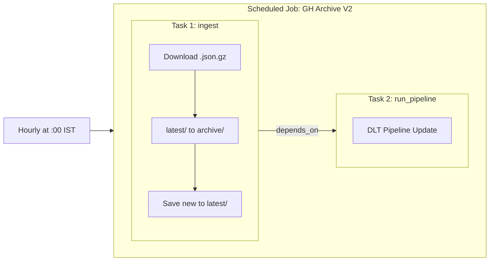
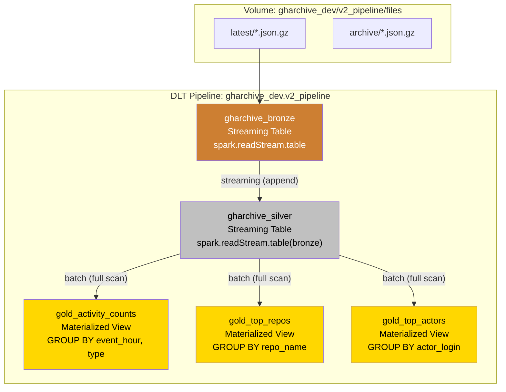
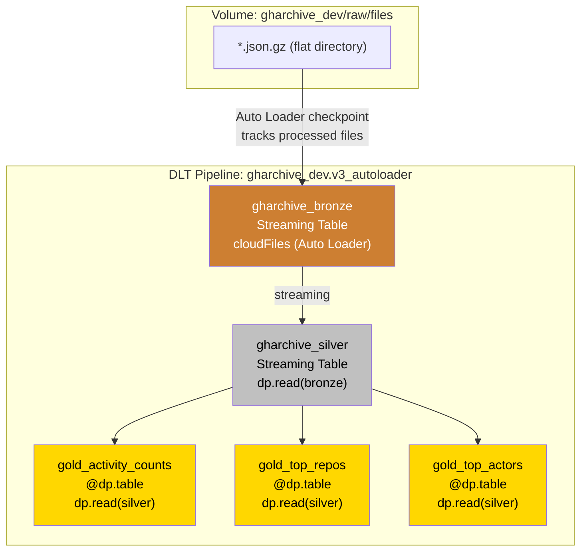
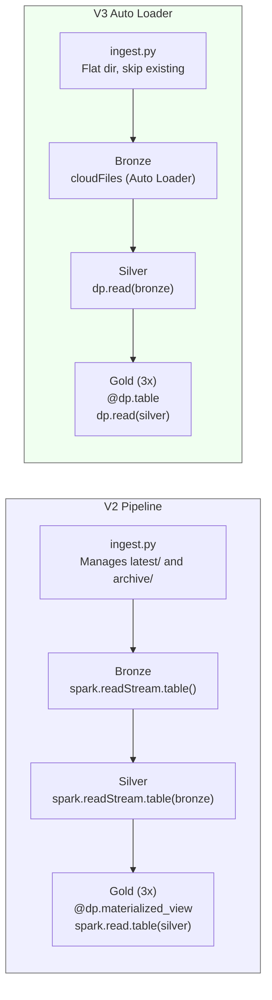
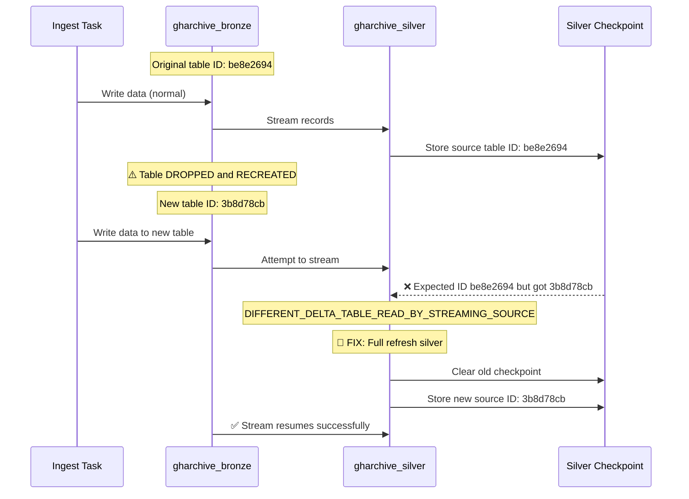
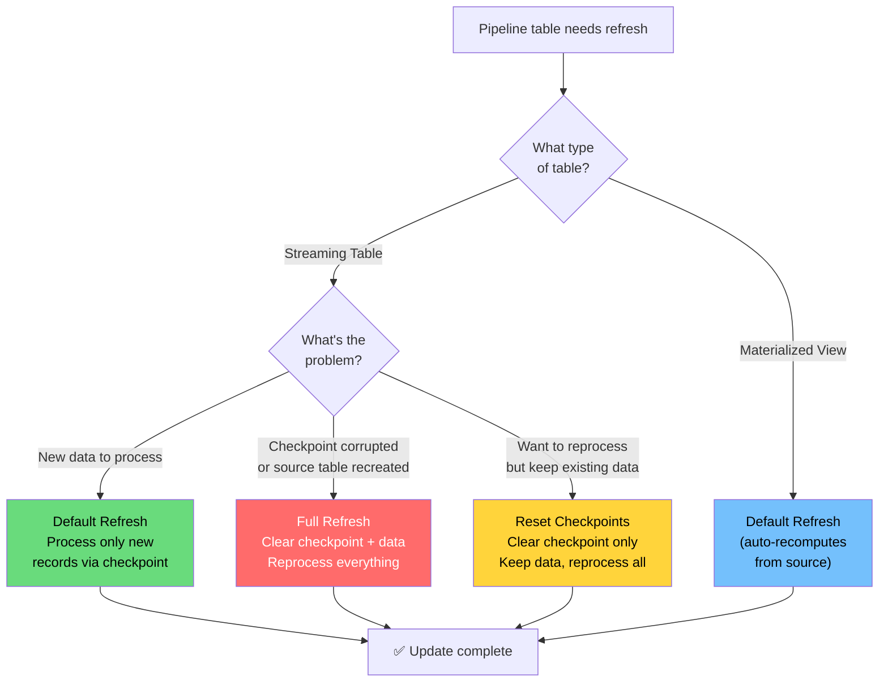
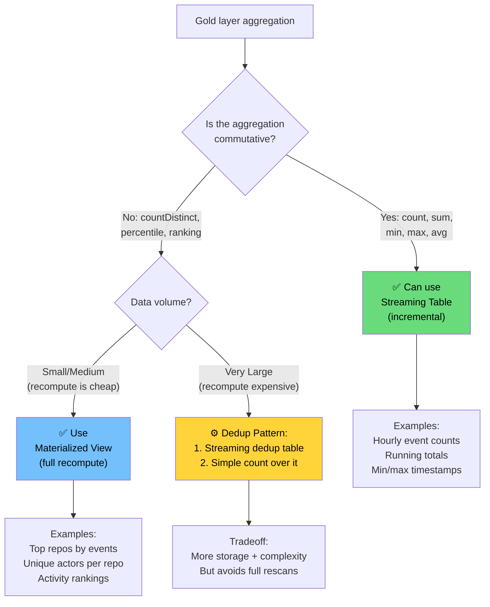
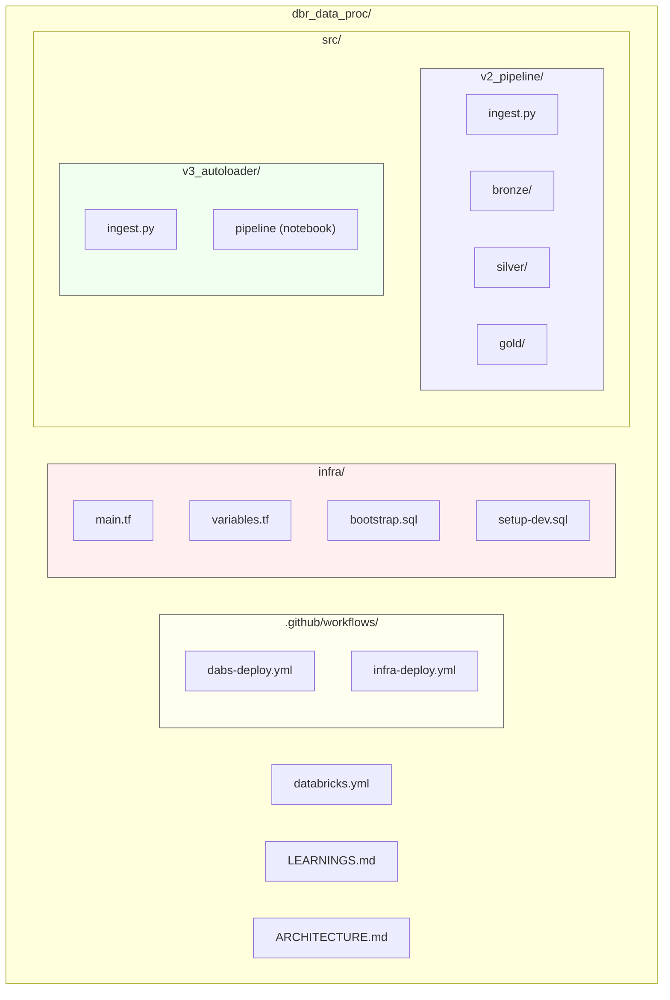
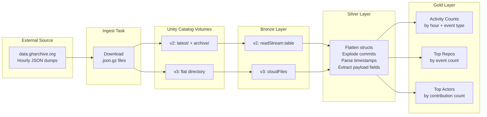

# GH Archive Pipeline — Architecture Diagrams

_Mermaid diagrams documenting pipeline architecture, data flows, and design decisions._

---

## 1. V2 Pipeline — End-to-End Job Orchestration

---

## 2. V2 DLT Pipeline — Data Flow DAG

---

## 3. V3 Auto Loader Pipeline — Data Flow DAG

---

## 4. V2 vs V3 — Side-by-Side Comparison

---

## 5. Incident: Silver Checkpoint Mismatch — What Happened

---

## 6. DLT Refresh Types — Decision Flow

---

## 7. Medallion Architecture — Streaming vs Batch Decision Tree

---

## 8. Project File Structure

---

## 9. Data Lineage — Volume to Gold

